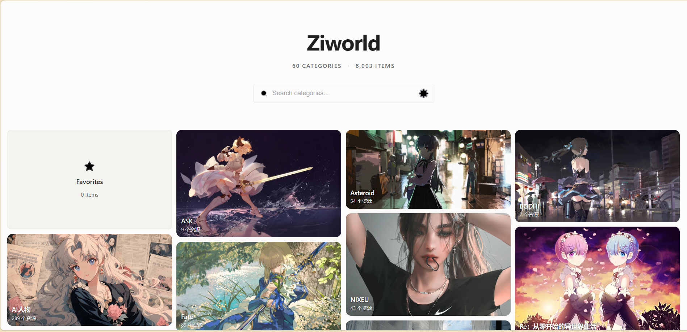
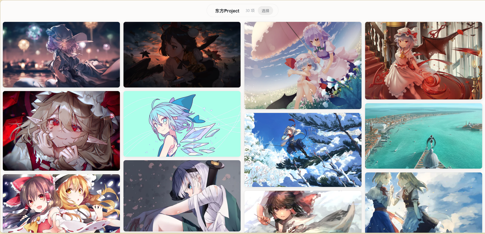

<div align="center">
  

  <h1>Img Gallery</h1>

  <p>
    一个基于 Vue 3 + Vite 的图片浏览画廊，支持多图源、分类浏览、收藏、全屏预览和批量下载。
  </p>

  <p>
    简体中文 / <a href="./README.en.md">English</a>
  </p>
</div>





---

## 快速开始

```bash
# 安装依赖
npm install

# 开发模式
npm run dev

# 构建生产版本
npm run build

# 预览生产版本
npm run preview
```

## 配置

### rule.yaml 详解

`rule.yaml` 是项目的**图源规则配置文件**，定义**第三方图源规则**

#### 配置结构

每个图源配置包含以下字段：

| 字段 | 说明 |
|------|------|
| `name` | 图源名称，对应 `data/` 目录下的文件名（如 `lh5`、`dt`） |
| `cover` | **缩略图 URL 模板**，用于列表页展示 |
| `display` | **预览图 URL 模板**，用于详情页/全屏查看 |
| `raw` | **原图 URL 模板**，用于下载或获取最高分辨率图片 |
| `download` | **下载方式**，`js` 表示通过 JS 下载，`zj` 表示跳转下载 |

所有 URL 模板中的 `{{id}}` 会被自动替换为对应id，若有对应资源为视频，在字段后加上_video即可

#### 示例解析

以 `lh5`（网易相册）为例：

```yaml
- name: "lh5"
  cover: "https://imglf5.lf127.net/img/{{id}}.jpg?imageView&thumbnail=811x0"
  display: "https://imglf5.lf127.net/img/{{id}}.jpg"
  raw: "https://imglf5.lf127.net/img/{{id}}.jpg"
  download: "js"
```

这是一个图片的封面：https://imglf5.lf127.net/img/ab828c669a6a693b/MVoxa3hqaHFmdHVhT09aR01tRUZxYWpiRVN4ZGN3Njk.jpg?imageView&thumbnail=811x0

这是原图：https://imglf5.lf127.net/img/ab828c669a6a693b/MVoxa3hqaHFmdHVhT09aR01tRUZxYWpiRVN4ZGN3Njk.jpg

只需将中间变的部分替换为{{id}}，将id存储在**/data/分类名/xx.lh5**

其中**分类名**为网站显示的分类

## 添加新内容

### 1. 新建分类目录

在 `data/` 下创建目录，例如 `data/我的分类/`

### 2. 添加图源文件

在分类目录下创建以图源扩展名命名的文件（如 `lh5`），每行一个资源 ID：

data/我的分类/1.lh5

```
abc123def456
ghi789jkl012
```

### 3.增加描述文件(可选)

在对应分类文件夹下面增加readme.md文件即可

## 站点信息配置

public/config.yml

```yml
# 站点配置
name: "Ziworld"
url: "https://gallery.ziworld.top"
description: "没有什么是完美的，这个世界并不完美，所以才显得美丽。"
keywords: "ziworld, images, 壁纸"
favicon: "/favicon.ico"

# Meta 标签（留空则自动用 name/description）
meta:
  title: "Ziworld"
  description: "我的图库"
  ogImage: ""

# 设置默认值
settings:
  defaultCardGap: 10
  defaultColumns: 0

# GitHub 图标（主页搜索栏右侧显示）
github:
  show: true
  url: "https://github.com/airesein/imgGallery2"

```

## 项目结构

```
├── data/                    # 分类数据目录（每个目录是一个分类）
│   ├── 原神/
│   │   ├── lh5              # 网易相册 lh5 图源 ID 列表
│   │   └── dt               # 堆糖图源 ID 列表
│   ├── 崩坏/
│   └── ...
├── public/
│   └── sw.js                # Service Worker（图片缓存）
├── scripts/
│   └── generate-catalog.mjs # 目录生成脚本
├── src/
│   ├── components/          # Vue 组件
│   ├── composables/         # 组合式函数
│   ├── router/              # 路由配置
│   ├── utils/               # 工具函数
│   ├── App.vue
│   └── main.js
├── rule.yaml                # 图源规则配置
├── vite.config.js
└── package.json
```

---

**语言**: 🇨🇳 中文文档 | 🇬🇧 [English Document](README.en.md) 

